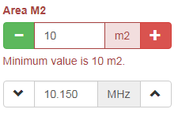

User input widget for numeric range with plus - minus handles for Yii2
======================================================================

Widget for framework Yii2 which enables to take user numeric input (integer, decimals) and increase/decrease the value by configured step, optionally within the min - max range.




Installation
============

```bash
$ composer require "lubosdz/yii2-ui-rangePlusMinus" : "~1.0.0"
```

Usage
=====

```php

<?= RangePlusMinus::widget([
	'model' => $model,
	'attribute' => 'frequency',
	'unit' => 'MHz',
	'min' => 10,
	'max' => 100,
	'decimals' => 3,
	'step' => 0.05,
	'cssMinusButton' => 'btn btn-default',
	'cssMinusIcon' => 'glyphicon glyphicon-chevron-down',
	'cssPlusButton' => 'btn btn-default',
	'cssPlusIcon' => 'glyphicon glyphicon-chevron-up',
]) ?>

<?= $form->field($model, 'area_m2')->widget(RangePlusMinus::className(), [
	'unit' => 'm2',
	'min' => 10,
	'max' => 100,
	'tooHigh' => Yii::t('app', 'Maximum value is {max}.'),
	'tooLow' => Yii::t('app', 'Minimum value is {min}.'),
	'step' => 5,
	'cssClassMinus' => 'fa fa-minus',
	'cssClassPlus' => 'fa fa-plus',
	'options' => [
		'onchange' => new JsExpression('console.log(this)'),
	],
]) ?>

```

Widget options
==============

Option         |Description
---------------|---------------
unit           | Measure unit, e.g. kg, MHz
cssWrapper     | CSS class to set field width within a row, defaults to `col-md-6`
thousandSep    | Thousands separator, defaults to empty string
decimalsSep    | Decimals separator, defaults to comma `.`
min            | Minimum allowed value
max            | Maximum allowed value
step           | Value increased or decreased by this value, defaults to `1`.
defaultValue   | The value set on first load
tooHigh        | Error message to show when the new value is higher than max value
tooLow         | Error message to show when the new value is lower than min value
decimals       | How many decimals should be value formatted to, default `0`
roundPrecision | How should be value rounded, e.g. 100 will round to hundreds, 1000 will round the value to thousands etc, default `0`
css            | Any custom CSS string
cssMinusIcon   | CSS class for the minus icon, defaults to `glyphicon glyphicon-minus`
cssMinusButton | CSS class for the minus button, sets the background color, defaults to `btn btn-success` (green button)
cssPlusIcon    | CSS class for the plus icon, defaults to `glyphicon glyphicon-plus`
cssPlusButton  | CSS class for the plus button, sets the background color, defaults to `btn btn-danger` (red button)


License
=======

This extension is open source and licensed under BSD-3-Clause (same as Yii2 framework).

--------------------------------------------------
